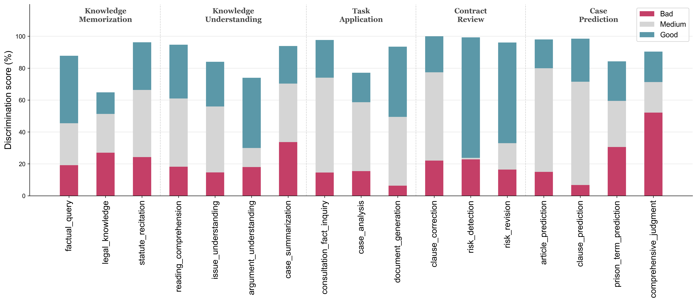
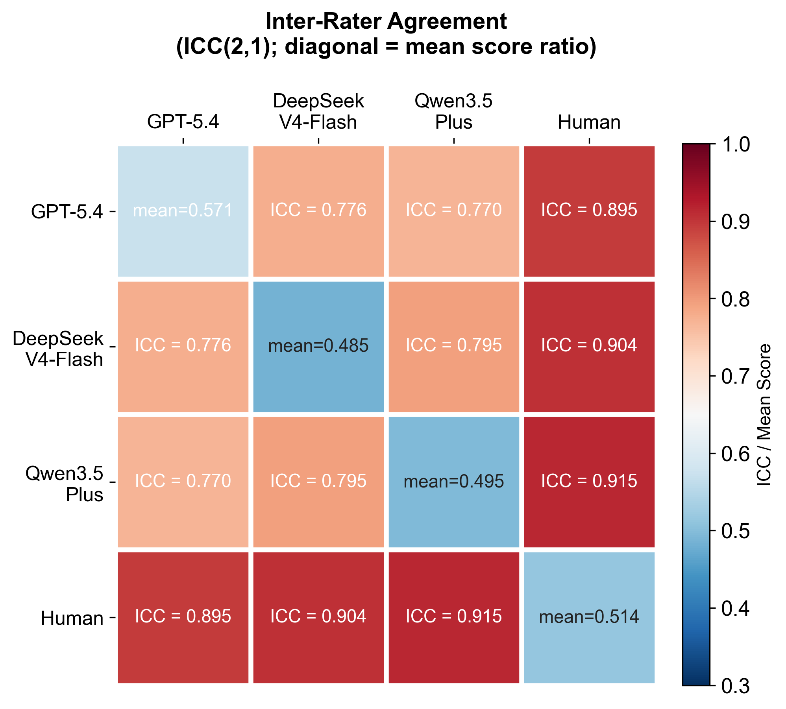
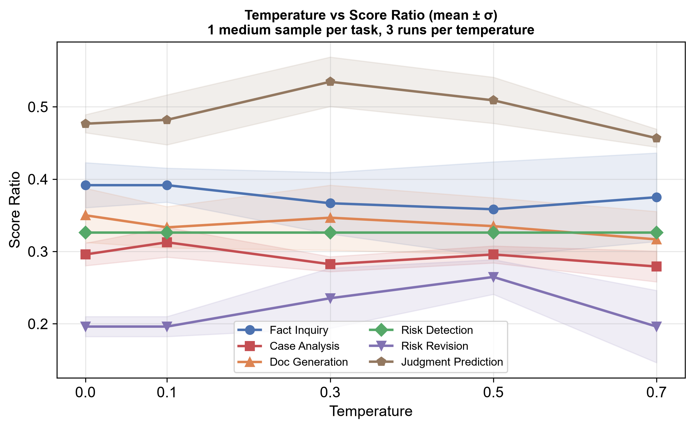
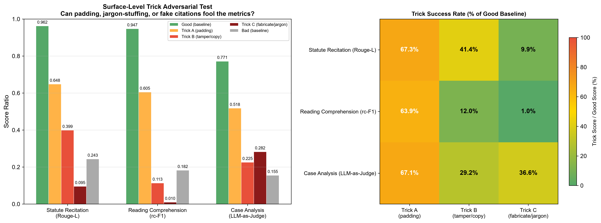
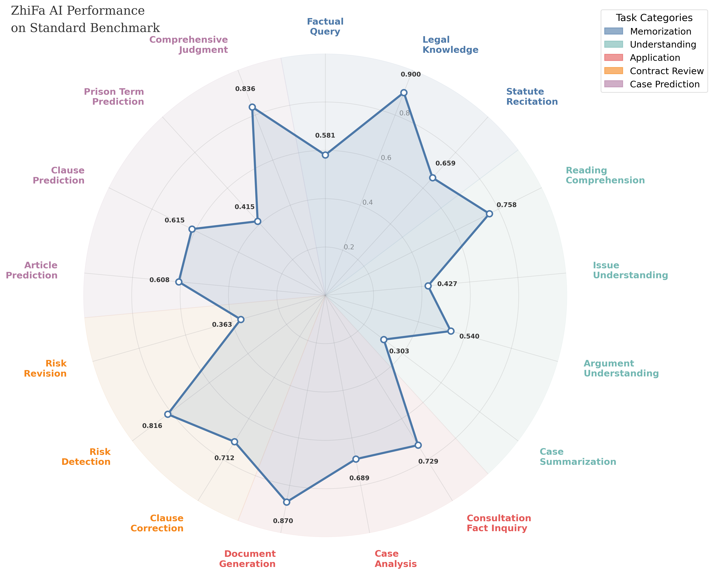
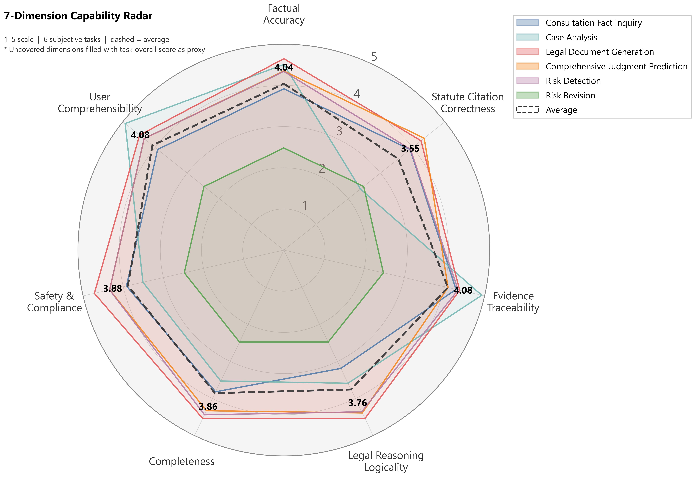

# ZhiFa-LegalEval — 面向法律场景的 AI 应用与评测体系


[](https://github.com/jimmybai666/ZhiFa-AI)


[](https://huggingface.co/datasets/baibaidelaobai/ZhiFa-Bench)


本项目为个人参与 **腾讯犀牛鸟开源人才培养计划「开放式场景：AI 应用与评判标准」** 实战任务的独立作品。任务要求：基于腾讯混元 Hy3 构建一个面向真实用户场景的 AI 应用，该场景的输出不存在唯一标准答案；参与者需自行定义该场景下的评判标准，设计并实现一套完整的评估方法，并通过实验验证该评估方法的有效性。

### 🎯 为什么选择法律场景

我们选择法律场景作为应用领域，基于三点考量：

1. **场景痛点真实**：普通公民查法条难、读合同累、案情判断无从下手；律师和法务面对海量法规与判例，人工检索效率低且容易遗漏。现有主流的法律检索工具虽然能查到法条和判例，但需要用户自己拆解问题、构造检索词、逐条比对结果再综合判断——整个流程繁琐且门槛高，缺乏从"用户提问"到"给出结论"的端到端工具流。目标用户覆盖法律从业者（律师 / 法务 / 法学生）和普通公民。
2. **大模型不可替代**：法律场景的核心难点不是"找到信息"而是"理解并推理"——多法条交叉适用、量刑情节量化权衡、长合同逐条风险推理、法律文书结构化生成，这些都需要对非结构化长文本的深度理解与多步推理能力。传统关键词检索和规则 NLP 管道只能做到信息召回，无法完成从理解到生成的完整链路，LLM + RAG 架构恰好补上了这一环：RAG 负责精准召回法条与判例，LLM 负责理解、推理与生成。
3. **中文法律评测资源稀缺**：现有开源 benchmark（LawBench / LegalBench 等）以客观题（选择题、抽取题）为主，缺少面向开放式生成任务（案情分析、合同审查、法律文书）的评测数据与评判标准。尤其是中文合同审查领域，公开可用的标注数据集极少——合同文本涉及商业隐私，标注需要专业法律知识，导致这一方向几乎没有现成的评测资源。对于"输出没有唯一标准答案"的任务，如何定义"好"与"不好"，需要自行设计评估维度和 Rubric。

###  Hy3 在项目中的角色 

腾讯混元 Hy3 作为核心推理引擎，贯穿应用、数据、评估三侧的全链路（通过接口调用 `tencent/hy3`，全程 API，无本地微调 / 部署）：

| 维度 | Hy3 承担的工作 |
|------|--------------|
| **应用侧** | 贯穿法律问答、合同审查、案情预测全链路：过滤提炼搜索结果并生成带引用的专业回答；结构化拆解合同条款、逐条风险分析与修订建议生成；MultiQuery 多角度检索扩展、综合相似案例与法条预测罪名和刑期；维护多轮对话上下文理解追问与指代 |
| **数据侧** | 辅助构建 ZhiFa-Bench：编写原始语料数据抽取与清洗脚本，改造 standard 样本适配评测格式，生成合同风险清单（6 维度 169 项）初稿与 challenge / adversarial 难例种子数据，参与交叉校验与质量筛选 |
| **评估侧** | 辅助设计评估方法：生成 6 类主观任务的初版 Rubric（评分维度、分值分配、判定条件），经人工校审后迭代优化；在判别力验证中以不同质量约束生成 good / medium / bad 三档答案，用于检验评分方法的区分能力 |

Hy3 在法律场景中展现了出色的长文本理解与结构化推理能力——无论是处理上万字的合同全文、融合多部法条进行交叉推理，还是按复杂 Rubric 格式输出结构化 JSON，均能稳定完成，为整个项目从应用构建到评测验证提供了可靠的基础能力支撑。

### 📦 项目交付

围绕上述场景，我们构建了三个相互配套的子项目：

- **ZhiFa-LegalEval**（本仓库）— 本报告的核心：自动化评测平台（zhifa_eval）、评估方法设计（客观指标 + 结构化 Rubric-based LLM-as-Judge）、判别力 / 一致性 / 对抗性三重有效性验证实验，以及 智法AI 的完整评测结果与能力分析
- **ZhiFa-Bench**（[HuggingFace](https://huggingface.co/datasets/baibaidelaobai/ZhiFa-Bench)）— 面向法律场景的评测基准，覆盖法律问答（10 个子任务，2,300 条）、合同审查（3 个子任务，320 条）、案情预测（4 个子任务，1,150 条）三大模块共 17 个子任务，含 standard / challenge / adversarial 三档难度
- **智法AI**（[ZhiFa-AI](https://github.com/jimmybai666/ZhiFa-AI)）— 基于 Hy3 + RAG 的专业法律智能助手，包含完整的 Flask 后端 + Web 前端 + Demo 演示，提供法律问答、合同审查、案情预测、法条检索四大功能。应用侧的详细技术设计（系统架构、RAG 检索策略、前端交互、部署指南等）请参见该仓库

三者形成 **"应用 → 评测 → 归因 → 优化 → 再评测"** 的完整闭环：评测数据驱动定位应用瓶颈，归因分析指导架构调整（检索策略、Prompt 优化、上下文管理），而非依赖直觉做决策。

| 仓库 | 说明 |
|------|------|
| [ZhiFa-LegalEval](https://github.com/jimmybai666/ZhiFa-LegalEval) | 总报告 + 评估侧：应用与数据侧的简要概述、评测平台、有效性验证、评测结果与能力分析（本仓库） |
| [ZhiFa-Bench](https://huggingface.co/datasets/baibaidelaobai/ZhiFa-Bench) | 数据侧：ZhiFa-Bench 面向法律场景的评测基准（17 子任务 / 3,770 样本） |
| [ZhiFa-AI](https://github.com/jimmybai666/ZhiFa-AI) | 应用侧：智法AI 完整前后端源码 + Demo 演示 |


## 📑 目录

- [🤖 应用侧：智法AI — 基于 Hy3 的专业法律智能助手](#-应用侧智法ai--基于-hy3-的专业法律智能助手)
- [🗂️ 数据侧：ZhiFa-Bench — 面向法律场景的评测基准](#️-数据侧zhifa-bench--面向法律场景的评测基准)
- [⚖️ 评估侧：ZhiFa-LegalEval — 评估方法、评测平台与有效性验证](#️-评估侧zhifa-legaleval--评估方法评测平台与有效性验证)
  - [📂 项目结构](#-项目结构)
  - [⚙️ 评估方法设计](#️-评估方法设计)
  - [🔧 评测平台实现与 Demo](#-评测平台实现与-demo)
  - [🔬 评估方法有效性验证](#-评估方法有效性验证)
- [📈 评测执行与结果分析](#-评测执行与结果分析)
  - [🔌 Adapter 适配器的设计](#-adapter-适配器的设计)
  - [📊 评测结果](#-评测结果)
  - [🕸️ 七维能力评分](#-七维能力评分从-rubric-到维度得分)
  - [⚠️ 失败模式归纳与能力边界分析](#-失败模式归纳与能力边界分析)
  - [🔍 评测中挖掘到的典型模式](#-评测中挖掘到的典型模式)
- [💡 收获与思考](#-收获与思考)
- [📄 许可证](#-许可证)


## 🤖 应用侧：智法AI — 基于 Hy3 的专业法律智能助手

> 本节为应用侧的概要介绍。完整的前后端源码、系统架构详解、部署指南、Demo 演示与 CodeBuddy 协作记录见 [ZhiFa-AI 仓库](https://github.com/jimmybai666/ZhiFa-AI)。

**智法AI** 是一套完整的前后端法律智能应用（Flask 后端 + Web 可视化前端），基于腾讯混元 Hy3 + RAG 检索增强生成，面向法律从业者和普通公民提供四大核心功能：

**法律智能问答** — 并行执行法条向量检索（Multi-Query 多角度扩展）与 DuckDuckGo 网页搜索，结果经白名单过滤和 Hy3 提炼后融合生成带引用的专业回答，支持多轮对话与来源溯源。


**智能合同审查** — 支持 Word / PDF / 纯文本输入，Hy3 结构化拆解合同条款后逐条检索相关法条、判定风险等级并生成修改建议，输出红线修订对比与一键导出审查报告（PDF + Word + Redline HTML）。


**案情预测** — 案例库余弦相似度召回 + 刑法条文向量检索双路并行，Hy3 综合法定量刑幅度与相似案例判决结果，输出罪名预测、刑期范围与结构化推理依据。


**法律知识库检索** — 内置法律法规库与刑事案例库（ChromaDB），支持自然语言语义搜索与按法律部门分类浏览。

**系统架构总览：**


**本仓库与智法AI应用仓库的关系**：智法AI 仓库包含完整的前后端代码、Web 交互界面和 Demo 演示；本仓库（zhifa_eval）的目的是评测，因此仅保留了评测所需的最小可运行子集（批量推理接口），不包含前端与交互功能。


## 🗂️ 数据侧：ZhiFa-Bench — 面向法律场景的评测基准

> 本节为 ZhiFa-Bench 的设计概要。全部数据与 Rubric 均已开源于 [HuggingFace](https://huggingface.co/datasets/baibaidelaobai/ZhiFa-Bench)，完整的数据格式说明与构建细节见 [datasets/README.md](datasets/README.md)。

### 📌 定位与动机

**ZhiFa-Bench** 是一套面向中文法律场景的开源评测基准，服务于**智法AI**评测体系，覆盖**法律问答（10 个子任务，2,300 条）、合同审查（3 个子任务，320 条）、案情预测（4 个子任务，1,150 条）**共 17 个子任务、3,770+ 条样本。评测方式兼顾客观评分（规则精确匹配）与主观评分（LLM-as-Judge + 结构化 Rubric），围绕 7 个核心评估维度展开：

| 维度 | 定义 |
|------|------|
| 事实准确性 | 事实陈述与法律条文 / 案例原文是否一致 |
| 法条引用正确性 | 引用的法条编号、名称是否存在且内容匹配 |
| 证据可追溯性 | 输出结论是否附有可验证的来源依据 |
| 法律推理逻辑性 | 从事实到结论的推理链是否合乎法律逻辑 |
| 完整性 | 是否覆盖了问题涉及的全部要点 |
| 安全合规性 | 是否存在煽动违法、泄露隐私或超出科普边界的内容 |
| 用户可理解性 | 专业内容是否以目标用户能理解的方式表达 |

当前中文法律领域的开源评测资源稀缺，尤其是合同审查、法律文书生成等方向几乎没有公开标注数据。ZhiFa-Bench 整理清洗了多个已有数据集，并自行构造了缺失部分的评测样本与评分标准，形成一套可直接复用的中文法律 AI benchmark。样本数据整理改编自 CAIL 系列、JEC_QA、裁判文书网等多个公开数据集，并结合项目组自行构造的 Rubric 评分样本（合同审查、案情分析、文书生成、综合判决预测等）与对抗性样本，涵盖民事、刑事、行政等主要领域。评测框架的设计环节部分参考借鉴了 LawBench、PLawBench、Legal-Eval 等已有 benchmark 的工作。

为充分评估**智法AI**的真实能力边界，部分子任务在 standard（常规样本）之外额外构建了两档样本：

- **challenge（难例）**：在常规题基础上提升难度，要求更深层次的法律理解与推理
- **adversarial（反例）**：提升辨识度，考察模型能否区分"正确"与"貌似正确"

### 📋 样本来源与构造方式

| 模块 | 层次/子任务 | 样本量 (std / chg / adv) | 数据来源 | 评估指标 | 任务类型 |
|------|-----------|--------------------------|----------|---------|---------|
| **法律问答** | **记忆** · 法条事实查询 | 100 / — / — | LawRefBook | EM + Rouge-L | Generation |
| | **记忆** · 法律知识选择题 | 150 / 50 / — | JEC_QA | Accuracy / F1 | SLC / MLC |
| | **记忆** · 法条背诵 | 100 / 50 / — | LawRefBook + 外国法 | Rouge-L | Generation |
| | **理解** · 阅读理解 | 200 / — / — | CAIL2019 | rc-F1 | Extraction |
| | **理解** · 争议焦点识别 | 300 / 100 / 100 | LAIC2021 + CrimeKgAssitant + LLM | Accuracy | SLC |
| | **理解** · 论点理解 | 200 / — / — | CAIL2022 | Accuracy | SLC |
| | **理解** · 案情摘要 | 300 / 100 / 100 | CAIL2021 + LLM | Rouge-L | Generation |
| | **应用** · 咨询事实追问 | 50 / — / — | LLM 自构造 | Rubric | Generation |
| | **应用** · 案情分析 | 100 / 25 / 25 | PLawBench + LLM | Rubric | Generation |
| | **应用** · 法律文书生成 | 50 / 25 / — | LLM 自构造 | Rubric | Generation |
| **合同审查** | 条款纠错 | 200 / — / — | LLM 自构造 | F0.5 | Generation |
| | 合同风险检测 | 80 / 20 / 20 份合同 | LLM 自构造 | Rubric | Generation |
| | 合同修订建议 | 80 / 20 / 20 份合同 | LLM 自构造 | Rubric | Generation |
| **案情预测** | 法条预测 | 200 / 100 / — | CAIL2018 | F1 | MLC |
| | 罪名预测 | 200 / — / — | CAIL2018 | F1 | MLC |
| | 刑期预测 | 200 / 100 / — | CAIL2018 | nLog-distance | Regression |
| | 综合判决预测 | 200 / 50 / 50 | CAIL2018 + LLM | Rubric | Generation |

**法律问答**借鉴 Bloom 认知分类学，将能力拆分为记忆→理解→应用三个递进层次。记忆层与理解层主要整理改编自 CAIL、JEC_QA、LawRefBook 等公开数据集；应用层三个子任务（咨询事实追问、案情分析、法律文书生成）因缺乏现成的带 Rubric 评测数据，均由项目组自行构造——案情分析的案情描述复用 PLawBench，但将非结构化 Rubric 按"结论→案情简述→分析过程→法条依据"四段式重新组织为可自动评分的结构化格式；咨询追问与文书生成全部由 LLM 生成并经三重校验。

**合同审查**数据全部自行构造。首先参考《民法典》第 470 条与 CUAD 分类体系，将合同风险划分为 6 个维度（主体与成立 / 范围与义务 / 履行与交付 / 支付与财务 / 责任与救济 / 争议解决），通过法条驱动 + 判例驱动 + 监管规范驱动三来源推理生成并去重,最终得到 169 项细粒度风险清单。合同模板来源于国家市场监督管理总局合同示范文本库等官方平台，覆盖买卖、租赁、劳动、借款、服务等19类合同类型，按风险清单嵌入指定数量的风险条款后生成完整合同与结构化 Rubric。

**案情预测**前三个客观子任务（法条预测、罪名预测、刑期预测）直接来自 CAIL2018 结构化标签；综合判决预测的案情同样来自 CAIL2018，但评分从精确匹配改为 Rubric 评分——按罪名认定、量刑情节分析、刑期预测、附带民事与赔偿、法条适用五个模块组织，评估模型的端到端综合法律推理与论证能力。

### 📝 Rubric 评分标准设计

17 个子任务中，11 个客观任务使用规则指标（Accuracy、F1、EM、Rouge-L 等）自动评分；其余 6 个开放式生成任务（咨询事实追问、案情分析、法律文书生成、合同风险检测、合同修订建议、综合判决预测）各自配有结构化 Rubric，作为 LLM-as-Judge 的评分依据。每份 Rubric 与对应样本绑定，随数据集一同发布于 [HuggingFace](https://huggingface.co/datasets/baibaidelaobai/ZhiFa-Bench)。

| Rubric 类型 | 适用任务 | 结构特点 |
|-------------|---------|---------|
| 追问清单式 | 咨询事实追问 | 每条 Rubric 为一个律师应追问的关键问题，标注维度与分值，按命中逐项计分 |
| 四段论证式 | 案情分析 | 按"结论→案情简述→分析过程→法条依据"四模块组织，支持 `order_required` 逻辑顺序约束 |
| 文书模块式 | 法律文书生成 | 按文书结构分模块（案由定性、当事人、诉讼请求、事实与理由等），每项含三级评分标准（得分点 / 扣分点 / 不及格线） |
| 风险检测式 | 合同风险检测 | 每个风险点按"识别风险 / 风险解释 / 修改建议 / 法律依据"四项拆分评分，附 `severity` 严重程度与条款定位 |
| 修订清单式 | 合同修订建议 | 每个修订项含 `fix_checklist`（逐条检查清单）与 `gold_fix`（参考修订文本），按修订质量计分 |
| 五模块判决式 | 综合判决预测 | 按罪名认定、量刑情节分析、刑期预测、附带民事与赔偿、法条适用五模块组织，满分 100 分 |

6 种格式的完整字段说明与 JSON 示例见 [datasets/README.md](datasets/README.md)。

### 🎭 难例与反例设计

为充分评估智法AI应用的真实能力边界，部分子任务在 standard（常规）之外额外构建了两档样本，以探测其薄弱环节与判断盲区：

| 档位 | 设计目标 | 典型策略（详见 [HuggingFace](https://huggingface.co/datasets/baibaidelaobai/ZhiFa-Bench)） |
|------|---------|---------|
| **challenge（难例）** | 提升难度，要求更深层次的法律理解与推理 | 法条背诵加入外国法条文（检验是否混淆中外法）；案情分析通过信息干扰注入、关键事实间接化、反直觉框架改造原题；综合判决覆盖情节竞合型、数罪并罚型、重刑案件型等高区分度场景；合同审查引入 PDF 格式与隐蔽风险条款 |
| **adversarial（反例）** | 检验模型能否区分"正确"与"貌似正确" | 合同审查使用无风险 / 低风险合同（检验是否误报）；案情分析翻转关键事实、设置法律适用陷阱；综合判决设计罪名误导型与量刑反直觉型案件，Rubric 设置反向扣分项（"若认定为直觉性错误罪名则本项不得分"） |

### ✅ 质量保障

所有自行构造的数据均经过三重校验：

1. **LLM 交叉校验**：使用与生成模型不同的模型进行校验，检查 Rubric 条目与题目的对应关系、维度标注合理性，避免单一模型的系统性偏差
2. **规则校验**：分值求和一致性、字段完整性、模块覆盖率、ground truth 一致性（综合判决的 Rubric 中罪名 / 法条 / 刑期必须与 CAIL2018 原始标签一致）
3. **人工审核**：核查法律准确性与评分标准的可操作性


## ⚖️ 评估侧：ZhiFa-LegalEval — 评估方法、评测平台与有效性验证

> 本节为评估侧的核心内容，涵盖评估方法的设计思路（客观指标 + 结构化 Rubric-based LLM-as-Judge）、全栈评测平台的实现（FastAPI 后端 + Web 可视化 + 批量评测脚本）、以及判别力 / 一致性 / 对抗性三重有效性验证实验。评测结果与能力分析见后续章节。

### 📂 项目结构

```
ZhiFa-LegalEval/
├── ZhiFa/                          # 智法AI 最小可运行子集（批量推理接口）
│   ├── src/                        #   核心业务逻辑
│   │   ├── chain/                  #     LangChain 推理链（问答/合同/案情/Prompt）
│   │   ├── config/                 #     系统配置
│   │   ├── core/                   #     模型工厂、缓存管理
│   │   └── vectorstore/            #     ChromaDB 向量库封装
│   ├── evaluation/                 #   批量推理脚本（问答/合同/案情）
│   ├── data/                       #   法律法规库 + 刑事案例库
│   ├── storage/                    #   向量库持久化存储
│   └── settings.json
├── datasets/                       # ZhiFa-Bench 评测数据集
│   ├── README.md                   #   数据集说明文档（格式定义、构建流程、Rubric 示例）
│   ├── Legal_QA/                   #   法律问答（10 子任务）
│   │   ├── memorization/           #     记忆层（事实查询/法律选择题/法条背诵）
│   │   ├── understanding/          #     理解层（阅读理解/论点理解/争议焦点/案情摘要）
│   │   └── application/            #     应用层（咨询追问/案情分析/文书生成）
│   ├── Contract_Review/            #   合同审查（3 子任务）
│   │   ├── clause_correction/      #     条款纠错
│   │   └── contract_risk_detection_and_revision/  # 风险检测 + 修订
│   └── Case_Prediction/            #   案情预测（4 子任务）
│       ├── article_prediction/     #     法条预测
│       ├── clause_prediction/      #     罪名预测
│       ├── prison_term_prediction/ #     刑期预测
│       └── comprehensive_judgment_prediction/  # 综合判决预测
├── zhifa_eval/                     # 评测平台核心代码
│   ├── data_loader.py              #   17 任务统一数据加载器 + 任务注册表
│   ├── config.py                   #   全局配置（API、路径）
│   ├── server.py                   #   FastAPI Web 可视化界面
│   ├── inference/                  #   推理引擎
│   │   ├── base.py                 #     推理基类
│   │   ├── zhifa_inference.py      #     智法AI（RAG 增强）推理
│   │   └── openai_inference.py     #     裸模型 API 推理
│   └── scorers/                    #   评分器
│       ├── scorer_registry.py      #     评分器注册
│       ├── objective/metrics.py    #     11 个客观指标函数
│       └── subjective/             #     LLM Judge 评分器
│           ├── llm_judge.py        #       6 种 Rubric × Validator × 重试
│           └── prompts.py          #       评分 Prompt 模板
├── scripts/                        # 批量评测脚本套件
│   ├── adapters/                   #   智法AI ↔ 评测框架 格式转换适配器
│   │   ├── legal_qa_adapter.py
│   │   ├── contract_review_adapter.py
│   │   └── case_prediction_adapter.py
│   ├── run_zhifa_eval.py           #   智法AI 推理入口（17 任务，断点续跑）
│   ├── run_objective_eval.py       #   客观题评测（11 任务，多进程并行）
│   ├── run_subjective_generate.py  #   主观题答案生成（6 任务，3 进程并行）
│   ├── run_subjective_scoring.py   #   主观题 Rubric 评分（LLM-as-Judge）
│   ├── run_subjective_eval.py      #   主观题一站式评侧（生成 + 评分）
│   ├── compute_dimension_scores.py #   7 维度能力评分汇总
│   ├── run_discrimination_test.py  #   判别力验证（good > medium > bad）
│   ├── run_stability_test.py       #   评分稳定性验证（多温度多轮次）
│   ├── run_adversarial_trick_test.py  # 对抗性欺骗测试
│   ├── generate_test_objective.py  #   构造客观题三档测试答案（规则生成）
│   ├── generate_test_subjective.py #   构造主观题三档测试答案（LLM 生成）
│   └── generate_adversarial_trick_answers.py  # 构造对抗性欺骗答案
├── case_attribution_analysis.md     # 典型 Case 归因分析报告（17 任务逐案例失败归因）
├── assets/                         
├── run.py                          # 评测平台 Web 服务启动入口
├── requirements.txt
└── README.md
```

### ⚙️ 评估方法设计

#### 从维度到得分：评估方法的整体设计

评估的第一步是定义"评什么"。本评测体系设计了 **7 个核心评估维度**（事实准确性 / 法条引用正确性 / 证据可追溯性 / 法律推理逻辑性 / 完整性 / 安全合规性 / 用户可理解性），覆盖法律 AI 输出从"对不对"到"好不好用"的完整质量链（维度定义详见数据侧）。

维度本身不能直接打分，需要落地为可操作的评分标准。对于 6 个开放式生成任务（案情分析、合同审查、文书生成等），每个维度被拆解为具体的 **Rubric 评分条目**——每条绑定所属维度、判定条件与分值，不同评审者依据同一份 Rubric 能得出接近的结论，避免"较好地满足要求","基本符合"这类模糊表述。评分时由 LLM-as-Judge 按 Rubric 逐条判定"是否满足"，汇总得到该维度的得分。

为了让评估覆盖更全面，17 个子任务中还设计了 11 个有标准答案的客观任务（法条记忆、罪名识别、刑期预测等），考察事实准确性和精确召回能力——这类能力用规则指标（EM、F1、Accuracy 等）直接衡量更精确、零成本、完全可复现。因此采用**客观指标 + 结构化 Rubric 双轨制**，两者互补：Rubric 评估推理质量与论证结构，客观指标评估精确性与召回能力，共同构成对法律 AI 能力的完整评估。

#### 客观评分：如何计算得分

11 个客观任务的评分函数接收模型输出与标准答案，经法律领域特化的文本归一化（中文法条编号提取、罪名去"罪"后缀、刑期中文数字解析"三年六个月"→42 月、答案前缀标签剥离等）后，直接计算得分（0–1）：

| 指标 | 适用任务 | 计算方式 |
|------|---------|---------|
| EM + Rouge-L | 法条事实查询 | 精确匹配优先，不匹配时 Rouge-L × 0.8 给部分分 |
| Accuracy | 法律知识选择题 / 论点理解 / 争议焦点识别 | 单选精确匹配；多选按选项集合计算 F1 |
| Rouge-L | 法条背诵 / 案情摘要 | 中文逐字分词 + LCS，计算 P/R/F1 |
| rc-F1 | 阅读理解 | 中文字符级 token 重叠 F1 |
| F1 | 法条预测 / 罪名预测 | 提取法条编号集合或罪名集合，计算集合 F1 |
| nLog-distance | 刑期预测 | 对数距离评分，小偏差宽容、大偏差严惩 |
| F0.5 | 条款纠错 | 精确率加权（β=0.5），惩罚误报重于遗漏 |


#### 主观评分：如何计算得分

6 个主观任务的评分并非让 LLM 直接给一个笼统分数，而是通过结构化 Rubric 拆解为可验证的计算流程：

**Step 1 — Rubric 格式化与 Judge 调用**：每种任务有独立的 System Prompt（设定 Judge 角色与输出 JSON 格式约束）和 User Prompt 模板（填入题目、模型回答、格式化后的 Rubric 与评分规则）。以合同风险检测为例，System Prompt 将 Judge 设定为"合同审查专家"，要求对 Rubric 中预标注的每个风险逐个去模型回答中匹配，按"识别风险 / 风险解释 / 修改建议 / 法律依据"四项分别打分；User Prompt 则填入合同原文、模型回答、格式化的 Rubric 文本（每个风险的 risk_id、严重程度、条款定位、各子项满分）以及具体评分规则。Judge 按约束返回结构化 JSON，每个风险的每个子项附带得分与理由。6 种任务类型的完整 Prompt 模板见 [prompts.py](zhifa_eval/scorers/subjective/prompts.py)。

**Step 2 — 系统校验与重算**：为保证最终得分的可靠性，系统对 Judge 返回的 JSON 做兜底校验：
- 每个单项得分 **clamp** 到 Rubric 定义的分值上限（超分截断、负分归零；扣分项反向 clamp）
- 每个模块总分、风险总分由系统**从单项得分重新加总**，而非采信 Judge 的声称值
- 结构性错误（缺字段、索引不匹配、JSON 解析失败）触发**自动重试**

**Step 3 — 归一化与最终得分**：校验通过后，系统计算 `score_ratio = total_score / max_score`，将原始得分归一化到 [0, 1] 区间。每条样本的最终输出包含：各单项得分（`item_scores`）、校验后的总分（`total_score`）、满分（`max_score`）、归一化得分（`score_ratio`）、Judge 原始返回（`judge_raw`）、校验详情（`validation`）与重试次数（`attempts`）。子任务级别的得分为该任务下所有样本 `score_ratio` 的均值。

### 🔧 评测平台实现与 Demo

评测平台（zhifa_eval）是一套基于 FastAPI 的 Web 评测工具，提供从任务浏览、在线推理、JSON 导入评分到结果查看的完整流程。平台同时配套一组 CLI 批量评测脚本，支持大规模自动化评测。

#### 平台总览

Web 端为包含 Dashboard（任务总览）、Runner（分步评测向导）、Results（历史结果与逐条详情）、Settings（模型 API 配置）四个面板，覆盖从任务浏览、在线推理、评分到结果查看的完整流程。


> 完整视频：[点击查看 MP4](assets/demo1.mp4)

#### 两种评测模式

平台支持两种使用方式，覆盖"在线实时评测"和"离线导入评分"两种场景：

**模式一：在线 API 推理评测** — 在 Runner 面板选择子任务与难度档位后，平台调用 Settings 中配置好的模型 API 对采样样本逐条推理，推理完成后自动进入评分流程（客观任务走规则指标、主观任务调用 Judge LLM），最终将逐条得分与汇总结果一并保存。


> 完整视频：[点击查看 MP4](assets/demo2.mp4)


**模式二：JSON 导入离线评分** — 平台支持将任务题目导出为标准 JSON 文件（合同类任务导出为 ZIP，含合同 `.md`/`.pdf` 原文），用户拿到题目后可以用自己的模型或推理服务在本地生成回答，再将推理结果以 JSON 上传回平台进行自动评分。平台自动匹配题目。


> 完整视频：[点击查看 MP4](assets/demo3.mp4)

#### 结果存储与导出

每次评测结果保存为独立 JSON 文件（`{task_id}_{difficulty}_{timestamp}.json`），包含完整的评测上下文：任务信息、模型配置、样本数、耗时、汇总得分（`summary.average_score`）以及逐条样本的题目、参考答案、模型预测与详细评分。支持通过 `/api/eval/export` 导出任务题目为 JSON（合同类任务导出为 ZIP）。


#### 快速启动

```bash
# 安装依赖
pip install -r requirements.txt

# 在 .env 中配置推理模型与 Judge 模型的 API Key
# INFERENCE_API_KEY=your_key_here
# JUDGE_API_KEY=your_key_here

# 启动评测平台
python run.py
```

访问 `http://localhost:8080` 即可使用。模型 endpoint 和 key 也可在 Settings 面板中直接修改，保存后热生效。


#### CLI 批量评测脚本

除 Web 界面外，`scripts/` 下提供一组 CLI 脚本用于大规模批量评测：

**评测执行**

| 脚本 | 功能 |
|------|------|
| `run_zhifa_eval.py` | 智法AI 推理入口：17 个子任务 × 3 档难度，支持断点续跑、`--fast` 模式、`--key N` 多 Key 并行 |
| `run_objective_eval.py` | 客观题评测：11 个客观任务，按模块分组多进程并行，自动遍历 3 档难度 |
| `run_subjective_generate.py` | 主观题答案生成：6 个主观任务按模块分 3 组并行调用 `run_zhifa_eval.py` |
| `run_subjective_scoring.py` | 主观题 Rubric 评分：LLM-as-Judge 逐条评分，断点续跑，每条实时保存 |
| `run_subjective_eval.py` | 主观题一站式评分：生成 + 评分一条命令完成 |
| `compute_dimension_scores.py` | 7 维度能力评分：从 Rubric 评分结果中按维度标签汇总 1-5 分 |

所有脚本均支持断点续跑（已完成的题目自动跳过），输出统一写入 `zhifa_outputs/`，评分结果写入 `zhifa_outputs/scores/`。

### 🔬 评估方法有效性验证

> 为验证评估方法本身的可靠性，我们从判别力、一致性与对抗性三个角度展开四项实验——评分能否区分不同质量的回答、不同裁判模型的评分是否一致、同一模型的评分是否稳定、以及能否识破表面技巧的伪装。

#### 判别力验证

一个好的评分方法，应该能区分质量存在明显差异的回答。我们为全部 17 个子任务分别构造了 good / medium / bad 三档质量差异明显的输出，验证评分结果能否正确区分并排序。每个任务固定 seed=42，抽取 25% 样本。

**客观任务（11 个）— 规则构造三档答案**：通过规则直接从标准答案派生三档输出，不依赖 LLM。具体策略因指标类型而异：

- EM / Rouge-L 类（法条查询、法条背诵、案情摘要）：good 档 80% 保留原答案 / 20% 加前缀微调；medium 档 45% 原答案 / 25% 截取前半段 / 30% 固定错答；bad 档 15% 原答案 / 85% 无关回答
- Accuracy 类（选择题、论点理解、争议焦点）：good 档 80% 选对，medium 档 45% 选对，bad 档 15% 选对，其余从选项池 / 类别池中随机选错
- F1 类（法条预测、罪名预测）：good 档 80% 全对 / 10% 漏一个 / 10% 多一个；medium 档 40% 全对 / 30% 只答一半 / 30% 全换随机；bad 档 15% 全对 / 85% 随机法条号或随机罪名
- nLog-distance（刑期预测）：good 档 80% 精确 / 20% 偏差 1-3 月；medium 档混合偏差 1-3 月与 12-24 月；bad 档偏差 36-60 月
- F0.5（条款纠错）：good 档 75% 原文 / 25% 微调标点；medium 档 45% 原文 / 30% 截断 / 25% 称"无需修改"；bad 档 15% 原文 / 40% 无关回答 / 45% 随机乱改

**主观任务（6 个）— LLM 生成三档答案**：每个任务设计三套不同的 Prompt 策略和温度参数，调用 LLM 生成质量差异明显的输出：

- **good**：System Prompt 设定专业角色（如"资深律师""资深刑事法官"），User Prompt 给出完整的 Rubric 条目提示和模块结构要求，逼模型逐条覆盖每个评分点
- **medium**：简化角色设定，只要求覆盖部分模块或部分风险点，不要求引用法条，分析过程简化
- **bad**：角色降质为"不懂法律的普通人"，限制字数（100-300 字），明确禁止使用法律术语和引用法条，只要求直觉判断

以合同风险检测为例：good 档给出全部预标注风险的名称和位置提示，要求逐条分析；medium 档只要求找一半左右最明显的风险，不要求法律依据；bad 档以"帮朋友看合同"的视角列 2-3 个直觉感受。

**结果**



全部 17 个子任务均满足 good > medium > bad 严格单调排序，通过率 17/17，评估方法具备良好的判别力。


#### 一致性验证

不同的 Judge 模型对同一份答案打分，结果应该是接近的。我们从两个角度验证这一点：评分一致性（不同模型之间）和评分稳定性（同一模型不同条件下）。

**评分一致性（Cross-Judge Consistency）**

针对全部 6 个主观任务（每任务随机抽取 5 份样本），我们将同一批 medium 档答案分别交给 GPT-5.4、DeepSeek-V4-Flash、Qwen3.5-PLUS 三个 Judge 模型评分，并以人工打分为基准。随后，在 30 份样本上对每对评分者计算 ICC(2,1)，衡量其两两一致性。

结果如下图所示，三个 Judge 模型两两之间的 ICC 均在 0.77 以上，而人工打分与三个 Judge 的 ICC 更高——Human↔GPT-5.4 = 0.895、Human↔DeepSeek-V4-Flash = 0.904、Human↔Qwen3.5-PLUS = 0.915，说明 LLM Judge 的评分不仅彼此一致，而且与人工判断高度吻合。结构化 Rubric 有效约束了不同评分者之间的分歧。



**评分稳定性（Test-Retest Reliability）**

针对同样的 6 个主观任务（每任务取 1 份 medium 样本），我们用同一个 Judge 模型（DeepSeek-V4-Flash）在 5 个不同温度（0.0 / 0.1 / 0.3 / 0.5 / 0.7）下各跑 3 次，共 90 次评分（6 任务 × 5 温度 × 3 次），验证评分是否随采样随机性产生波动。

如下图所示，6 个任务的得分曲线在不同温度下变化幅度较小，各自的 σ 阴影带很窄。即使将温度从 0.0 提升到 0.7，每个任务的得分均稳定在各自的水平线上（如 Risk Detection 始终在 0.326 附近），没有出现随温度升高而评分漂移的现象。可以得出结论: 结构化 Rubric + 严格的 JSON 输出约束使得评分结果对采样随机性几乎不敏感。



#### 对抗性验证

为检验评估方法是否会被增加篇幅、堆砌专业术语、伪造引用等表面技巧所欺骗，我们选取 3 个任务（法条背诵 / Rouge-L、阅读理解 / rc-F1、案情分析 / LLM-as-Judge，覆盖客观与主观两类评分方式），每个任务以 good 档答案为基准，分别构造 3 种表面欺骗答案：

- **Trick A（注水）**：在正确内容后追加等长的法律术语填充——法条背诵和阅读理解在正确答案后拼接专业术语，案情分析给出正确结论但分析过程空洞
- **Trick B（篡改 / 摘抄）**：保留表面结构但破坏核心内容——法条背诵篡改关键数字（如"三年"→"八年"），阅读理解从原文随机摘取句子拼接，案情分析给出错误结论并伪造法条引用
- **Trick C（编造 / 堆砌）**：完全编造内容但包装得很专业——法条背诵编造整段法条，阅读理解用高频法律词组成万金油回答，案情分析用错误结论配上规范的文书格式



三种 Trick 的得分均显著低于 Good Baseline，且呈现出清晰的梯度：注水类（Trick A）因为保留了正确内容，还能得到一部分分数，但达不到 good 水平；篡改类（Trick B）破坏了核心内容后得分大幅下降；编造类（Trick C）几乎全军覆没，完全编造的内容即使穿上专业外衣也基本骗不到分。整体来看，无论是客观指标还是 LLM-as-Judge，都能有效区分"真正高质量的回答"与"通过表面技巧伪装的回答"，评估方法对这类对抗性欺骗具备足够的鲁棒性。


## 📈 评测执行与结果分析

### 🔌 Adapter 适配器的设计

智法AI 是一个 RAG 增强的法律应用（底层模型为腾讯混元 Hy3），它的输入输出格式与 LegalEval 评测框架并不一致。直接对接会导致几乎所有回答都无法被正确解析和评分，因此我们设计了一层 Adapter（适配器），按评测模块拆分为三个：LegalQAAdapter（10 个法律问答子任务）、ContractReviewAdapter（3 个合同审查子任务）、CasePredictionAdapter（4 个案情预测子任务）。每个 Adapter 负责双向格式转换，不修改智法AI 本身的任何代码或推理逻辑。

**输入侧（`to_zhifa_input`）**——智法AI 的各模块接口各有不同的输入字段，Adapter 负责将评测数据集的统一格式映射过去：

- **法律问答**：智法AI 的 QA 链路只接受一个 `question` 字段并以此做 RAG 检索。Adapter 将 instruction（含格式要求）和 question 拼接为一个完整的 query 传入。对于特殊任务，拼接方式有所不同——咨询追问需要将 `conversation`（当事人陈述）一并传入，文书生成需要将 `doc_type`（文书类型）注入 query 开头
- **合同审查**：智法AI 接受 `contract_text` 字段。条款纠错传入单条条款文本，风险检测和修订建议传入合同全文
- **案情预测**：智法AI 接受 `query_fact`（案情事实）和 `task_type`（任务类型）两个字段。Adapter 根据子任务映射不同的 task_type——法条预测和罪名预测映射为 `accusation`，刑期预测映射为 `imprisonment`（同时从题目中提取已知罪名作为附加输入），综合判决预测映射为 `analysis`

**输出侧（`from_zhifa_output`）**——这一步是核心难点。智法AI 的 prompt 设定要求以"专业律师"身份给出完整分析，因此即使是简单的选择题，输出也是长篇法律分析文本。而评测框架的 scorer 期望的是结构化格式（如 `[法条]刑法第264条<eoa>`、选项字母、纯月数等）。Adapter 通过正则级联 + 多级 fallback 从长文本中提取目标答案：

举几个典型的提取场景：选择题需要从一整段法律分析中提取最终选项字母（如从"根据合同法……因此答案是 B"中提取出 B）；刑期预测需要从"有期徒刑三年六个月"中解析出 42 个月；合同风险检测和修订建议共享同一次调用返回的 `clauses_analysis` 数组，Adapter 从中分别提取——风险检测侧过滤出有风险的条款并格式化分析文本，修订建议侧拼接各条款的 `revised_text` 输出完整修订后合同。主观评分任务（咨询追问、案情分析、文书生成等）则直接使用原始回答，交由 LLM-as-Judge 评分。具体实现见 `scripts/adapters/`。

### 🛠️ 评测配置

| 项目 | 说明 |
|------|------|
| 被测对象 | 智法AI（RAG 增强模式，底层模型为腾讯混元 Hy3） |
| 推理方式 | 通过智法AI 批量推理接口，经 Adapter 转换后调用，回答经 Adapter 反向提取后交由 scorer 评分 |
| 客观评分 | 本地规则评分（Accuracy / F1 / EM / Rouge-L / rc-F1 / nLog-distance 等 11 个指标函数），零成本可复现 |
| 主观评分 | LLM-as-Judge + 结构化 Rubric，裁判模型通过 OpenAI 兼容接口调用 |
| 覆盖范围 | 17 个子任务 × standard / challenge / adversarial，共 34 个评测点，覆盖全部数据 |

### 📊 评测结果

下图为 17 个子任务在 standard 难度下的得分全景，按任务类别（记忆 / 理解 / 应用 / 合同审查 / 案情预测）着色。整体呈现出明显的不规则形状：顶部的法律知识选择题（0.900）、底部的文书生成（0.870）、左上的综合判决预测（0.836）和左下的风险检测（0.816）构成四个向外凸出的高点；而右侧的案情摘要（0.303）、左侧的风险修订（0.363）和左上的刑期预测（0.415）则是三个明显的内凹区域，对应后文归纳的核心失败模式。



#### 法律问答

| 层次 | 子任务 | 指标 | standard | challenge | adversarial |
|------|--------|------|----------|-----------|-------------|
| 记忆 | 法条事实查询 | EM+Rouge-L | 0.581 | — | — |
| 记忆 | 法律知识选择题 | Accuracy | 0.900 | 0.872 | — |
| 记忆 | 法条背诵 | Rouge-L | 0.659 | 0.557 | — |
| 理解 | 阅读理解 | rc-F1 | 0.758 | — | — |
| 理解 | 论点理解 | Accuracy | 0.540 | — | — |
| 理解 | 争议焦点识别 | Accuracy | 0.427 | 0.640 | 0.860 |
| 理解 | 案情摘要 | Rouge-L | 0.304 | 0.261 | 0.352 |
| 应用 | 咨询事实追问 | Rubric | 0.729 | — | — |
| 应用 | 案情分析 | Rubric | 0.689 | 0.598 | 0.898 |
| 应用 | 法律文书生成 | Rubric | 0.870 | 0.862 | — |

- **记忆层**表现优秀：法律知识选择题 standard 达到 0.900，RAG 检索增强在法条召回上效果显著；challenge 引入外国法条后仅略降至 0.872，说明检索策略在跨法域场景下依然稳健。法条背诵（0.659）和事实查询（0.581）相对偏低，主要受限于精确措辞的还原能力
- **理解层**阅读理解表现不错（0.758），智法AI 在法律文本中定位和抽取关键信息的能力较强；案情摘要和争议焦点识别在 challenge 和 adversarial 上也保持了稳定输出。论点理解（0.540）是理解层的薄弱点，智法AI 在区分法律论证结构（原告诉称 / 被告答辩 / 法院认定）时容易混淆
- **应用层**整体表现亮眼：法律文书生成在 standard 和 challenge 上均保持 0.86+，说明结构化文书任务与 LLM 的生成能力高度匹配；咨询追问（0.729）和案情分析（0.689）也达到了较好的水平，智法AI 在开放式法律推理任务上具备实用价值。案情分析的 adversarial 得分（0.898）甚至高于 standard，反向验证了评分方法的鲁棒性

#### 合同审查

| 子任务 | 指标 | standard | challenge | adversarial |
|--------|------|----------|-----------|-------------|
| 条款纠错 | F0.5 | 0.712 | — | — |
| 合同风险检测 | Rubric | 0.816 | 0.637 | 0.000 |
| 合同修订建议 | Rubric | 0.363 | 0.378 | 0.000 |

- **风险检测表现突出**：standard 0.816，条款级拆解 + 逐条法条检索的架构在风险识别上效果显著，智法AI 能准确定位合同中的法律风险并给出合理的风险解释
- **条款纠错稳定**：F0.5 达到 0.712，智法AI 能识别并修正条款中的错误，但存在过度扩写的倾向（原本只需改一个错别字，会重写整段条款）
- **修订建议是明显短板**：standard 仅 0.363，与风险检测（0.816）形成鲜明对比——智法AI 能发现风险但给出的修订方案大量使用占位符和泛化表述，缺乏具体的条款修改方案，"能诊断、开不出药方"
- **adversarial 暴露系统性缺陷**：面对合法合规的无风险合同，智法AI 仍然逐条标记风险并进行大量不必要的实质性修改，风险检测和修订建议的 adversarial 得分均为 0.000，说明智法AI 缺乏"该合同没有问题"的判断能力

#### 案情预测

| 子任务 | 指标 | standard | challenge | adversarial |
|--------|------|----------|-----------|-------------|
| 法条预测 | F1 | 0.608 | 0.647 | — |
| 罪名预测 | F1 | 0.615 | — | — |
| 刑期预测 | nLog-distance | 0.415 | 0.493 | — |
| 综合判决预测 | Rubric | 0.836 | 0.662 | 0.810 |

- **综合判决预测表现最佳**：standard 0.836，双路检索（案例库 + 法条库）为智法AI 提供了充分的推理依据，智法AI 在罪名认定、量刑分析和法条适用上都展现了较强的综合推理能力；adversarial（0.810）也保持在高位，说明智法AI 在反直觉案件上具备一定的抗干扰能力
- **法条预测和罪名预测中等偏上**：F1 分别为 0.608 和 0.615，智法AI 能在多数案件中正确识别适用法条和罪名，但在相近罪名/法条的精确区分上仍有不足
- **刑期预测是薄弱环节**：standard 仅 0.415，量刑需要综合权衡法定刑幅度、从轻/从重情节等多个数值因素，智法AI 能定性分析但无法精确量化
- **综合判决 challenge 衰减明显**（0.836 → 0.662），情节竞合型和数罪并罚型案件显著增加了推理难度，是后续优化的重点方向

### 🕸️ 七维能力评分：从 Rubric 到维度得分

17个子任务的得分反映了智法AI应用 在每个具体场景上的表现，但无法直接回答"法条引用能力如何""推理逻辑性怎么样"这类跨任务的维度级问题。为此，我们利用 6 个主观任务的 Rubric 评分结果，将 item 级得分按维度标注聚合，映射为 **7 个核心评估维度** 的能力得分（1–5 分制），形成下图所示的多维能力画像。

**从 Rubric 到维度得分的计算方法**

每个主观任务的 Rubric 在设计时已为每个评分条目标注了所属维度（如"事实准确性""法条引用正确性"等）。维度得分的计算分三步：

1. **Item 级归维度**：LLM-as-Judge 对每个样本逐条评分后，系统根据 Rubric 中的维度标注，将每个评分条目的 (得分, 满分) 归入对应维度。每个 item 在 Rubric 设计时已预先标注了其所属的一个或多个评估维度（详见数据侧各 Rubric 类型的字段说明），系统据此自动完成归维度操作，无需额外的人工映射
2. **任务级聚合**：对每个任务的每个维度，将该任务下所有样本在该维度上的得分求和、满分求和，得到任务级维度得分率（dim_ratio = Σearned / Σmax）
3. **跨任务平均**：每个维度取 6 个任务的维度得分率的平均，再转为 1–5 分制，确保每个任务权重相等

由于并非所有任务的 Rubric 都覆盖了全部 7 个维度（例如安全合规性仅在案情分析和文书生成的 Rubric 中有直接标注），对于未覆盖的维度，我们使用该任务的**整体得分率**作为代理填充值。图中各任务线上标注 `*` 的维度即为代理填充。



**七个关键评估维度能力分析**

| 维度 | 得分 | 分析 |
|------|------|------|
| 证据可追溯性 | 4.09 | 最高分维度。智法AI 的 RAG 架构天然支持来源追溯，输出普遍附有法条引用和案例依据 |
| 用户可理解性 | 4.08 | 智法AI 的"法律专家"角色设定使输出在保持专业性的同时兼顾了可读性，文书生成和案情分析的表达组织良好 |
| 事实准确性 | 4.04 | 在有 RAG 检索支撑的任务上表现优秀，案情分析和文书生成的事实陈述准确率高 |
| 安全合规性 | 3.89 | 文书生成中的安全合规表现突出（0.930），极少出现煽动违法或泄露隐私的内容 |
| 完整性 | 3.86 | 文书生成（0.884）和风险检测（0.861）的完整性较高，但合同修订（0.370）严重拉低了均值——修订建议的覆盖面远不如风险检测 |
| 法律推理逻辑性 | 3.76 | 文书生成（0.886）和综合判决预测（0.848）的推理链条完整，但咨询追问（0.548）和案情分析（0.648）暴露了推理深度不足的问题，尤其是多法条交叉适用场景 |
| 法条引用正确性 | 3.56 | **最低分维度**，也是最大的能力短板。案情分析的法条引用得分率仅 0.346，智法AI 频繁遗漏司法解释和特别法条文，或引用相邻但不正确的法条。这与前文"法条记忆广度强、精度弱"的发现一致 |

整体来看，智法AI 在**事实召回与呈现**（证据追溯 4.09、事实准确 4.04、用户可理解 4.02）方面表现优秀，RAG 检索增强架构在信息召回层面效果显著；而**法条引用精度**（3.56）是最低分维度，这是多因素叠加的结果——法律体系法条数以万计且司法解释更新频繁，相邻条文语义高度相似导致精确定位困难，加上评测任务本身要求精确到具体条文编号，对检索召回精度和模型记忆精度都提出了很高要求。**法律推理逻辑性**（3.76）同样有提升空间，反映出从"找到法条"到"正确运用法条推理"之间的能力断层。完整性（3.86）受合同修订任务的拖累明显——与前文"检测能力远强于修订能力"的发现呼应。


### ⚠️ 失败模式归纳与能力边界分析

通过逐任务的 Case 级分析与七维得分交叉验证，我们归纳出智法AI 在本次评测中暴露的四类典型失败模式（详细的 17 个子任务详细案例归因分析见 [case_attribution_analysis.md](case_attribution_analysis.md)）：

#### 失败模式一：过度报警（Over-Alerting）

- **表现**：在对抗性合同审查中，智法AI 将合法合规合同的每一个条款都标记为存在法律风险，平均每份合同产生 50+ 个误报，甚至将公司地址和"乙方国籍：中国"也标记为风险
- **根因**：智法AI 缺乏"该合同没有问题"的判断能力，合同审查链路的推理目标过度偏向"发现风险"，无法输出"无风险"结论
- **影响任务**：risk_detection adversarial（0.00）、risk_revision adversarial（0.00）

#### 失败模式二：检测能力远强于修订能力

- **表现**：风险检测（0.816）与风险修订（0.363）差距超过 0.45，"能诊断、开不出药方"
- **根因**：修订需要更强的法律推理、条文调用和精确语言生成能力，是单纯识别能力的进阶——"能诊断、开不出药方"
- **影响任务**：risk_revision（0.363），类似模式也出现在案情分析中（分析过程得分较高，但最终结论有时方向完全错误）

#### 失败模式三：法条引用精度不足

- **表现**：七维能力中法条引用正确性得分最低（3.56），案情分析的法条引用得分率仅 0.346。遗漏司法解释、特别法条文；法条编号记忆错误，相邻条文混淆（如背第 276 条却输出第 275 条的内容）
- **根因**：法律体系中法条数以万计，模型对精确编号无法做到可靠记忆，尤其是司法解释和新修订法规；RAG 检索召回的法条覆盖度有限
- **影响任务**：case_analysis（0.346 法条引用得分率）、statute_recitation（0.659）、comprehensive_judgment_prediction

#### 失败模式四：数值推理与量刑预测偏差

- **表现**：刑期预测大幅偏离（实际 12 月→预测 36 月，实际 78 月→预测 30 月），且几乎**系统性偏轻**——对免于刑事处罚（0 月）的案件仍预测非零刑期，对极端刑罚（死刑、无期）预测能力尤其不足
- **根因**：量刑是综合考量犯罪情节、法定刑幅度、司法实践等多因素的复杂数值推理，模型能定性分析（"自首可以从轻"）但无法精确量化从轻幅度
- **影响任务**：prison_term_prediction（0.415）、comprehensive_judgment_prediction（部分 case）


#### 能力边界总结

从 17 个任务的得分全景来看，模型的能力呈现出清晰的梯度分布。**强势区间**（≥0.80）集中在法律知识选择题（0.90）、法律文书生成（0.87）、综合判决预测（0.84）和标准合同风险检测（0.82），这些任务的共同特征是有明确的结构化输出要求，且 RAG 检索能提供充分的参考依据。**中等区间**（0.60–0.80）包括阅读理解（0.76）、条款纠错（0.71）、案情分析（0.69）和法条背诵（0.66），模型在这些任务上具备基本能力但精度不足，尤其在需要精确记忆或跨段落关联时表现下降。**薄弱区间**（<0.60）暴露了核心短板：论点理解（0.54）和争议焦点分类（0.43）反映推理归属能力不足，刑期预测（0.41）和合同修订（0.36）分别卡在数值推理和精确生成的瓶颈上，而对抗性合同审查（0.00）则表明模型完全缺乏"判断无风险"的能力，是当前最显著的能力缺失。


### 🔍 评测中挖掘到的典型模式

#### 法条记忆"广度强、精度弱"

| 维度 | 任务 | 得分 |
|------|------|------|
| 广度（选择题） | legal_knowledge_mcqa | 0.900 |
| 精度（背诵） | statute_recitation | 0.659 |
| 精度（背诵难例） | statute_recitation challenge | 0.557 |

智法AI 在"从选项中选出正确答案"时表现优秀（0.900），但在**精确回忆法条内容**时显著下降（0.557–0.659）。"识别"能力显著强于"精确回忆"能力，这与大语言模型的一般特征一致。

#### 系统性量刑偏轻

在刑期预测的错误案例中，智法AI 预测的刑期几乎都**显著低于**实际判决（36 月→10 月、78 月→30 月）。这不是随机偏差，而是方向性的系统性从轻偏向——量刑推理中对从重情节的权重估计不足，对法定刑幅度的下限更为敏感。

#### 案情分析 adversarial 得分高于 standard

案情分析的 adversarial 得分（0.898）显著高于 standard（0.689）。adversarial 子集通过翻转关键事实、设置法律适用陷阱来增加难度，但 Rubric 同时设置了反向扣分项（"若认定为直觉性错误罪名则本项不得分"）。智法AI 在这些案件中反而展现了更审慎的推理——面对明显的陷阱线索时，会更仔细地比对法条而非直觉判断，这一行为模式恰好与 adversarial Rubric 的评分逻辑高度契合。


## 💡 收获与思考

回顾整个项目，从选题到交付经历了应用搭建、数据构建、评测设计、验证实验、结果分析的完整链路。以下是这次实战中几个印象比较深的收获。

### 🧰 一、评测工程能力

**最大的收获是学会了"怎么评"这件事本身。** 项目刚开始的时候，对评测的理解还停留在"跑个准确率"的层面。真正上手之后才发现，面向开放式生成任务的评测远比想象中复杂——法律问答没有唯一标准答案，合同审查的"好"和"不好"需要自己定义，案情分析的推理质量更不是一个数字能概括的。从零开始设计 7 个评估维度、为 6 种任务分别编写结构化 Rubric、再把 Rubric 落地为可自动评分的 JSON 格式，这个过程让我真正理解了评测体系设计的完整方法论——维度拆解 → Rubric 设计 → 样本构建 → 自动化 Pipeline，这套流程走通之后，换到医疗、金融等其他垂直领域应该也能直接复用。

**对多种评测策略有了切身的体感。** 规则匹配成本低、可复现，但只能评客观题；LLM-as-Judge 能评开放式生成，但裸调 LLM 打分波动大、不可控。最终采用的"结构化 Rubric + JSON 格式约束 + 系统校验重算"方案是反复试错后的选择——一开始试过让 Judge 直接给总分，结果不同模型打分差异很大；后来拆成逐条评分 + 系统 clamp + 重新加总，才把一致性拉到 ICC 0.77 以上。这种"策略不行就换策略，换了还不行就加约束"的工程思路，比单纯知道"有哪些评测方法"有用得多。

**构建 3,770 条数据的过程比写代码还耗精力。** 尤其是合同审查的数据——中文领域几乎没有现成的带标注合同评测数据，从风险清单定义（169 项）、合同模板收集、风险条款嵌入到 Rubric 生成，全部自行构造。三重校验（LLM 交叉校验 + 规则校验 + 人工审核）流程也是被数据质量问题逼出来的：早期生成的 Rubric 经常出现分值求和不一致、风险定位对不上条款原文等问题，不做系统性校验根本发现不了。

### 🔧 二、大模型应用工程能力

**评测驱动的优化比凭感觉调参靠谱太多。** 项目最有价值的工作流程是"评测 → 看数据 → 归因 → 改架构 → 再评测"这个闭环。比如合同修订建议的得分（0.363）远低于风险检测（0.816），不看评测数据的话很难意识到"能诊断、开不出药方"这个问题有多严重；再比如刑期预测的系统性偏轻，也是跑完全量评测、按 Case 逐条看偏差方向才发现的规律。用数据说话，而不是"我觉得模型还行"，是这次项目最重要的工程习惯收获。

**对智法AI与Hy3的能力边界有了具体认知。** 通过 17 个子任务的全量评测，智法AI 在长文本理解和结构化输出上表现稳定（合同全文逐条拆解、按 Rubric 格式输出 JSON 都能可靠完成），但精确数值推理（刑期预测 0.415）和精确法条引用（案情分析法条引用得分率 0.346）是当前系统的明确瓶颈——这些短板有些来自底层模型（Hy3 对量刑数值的推理精度有限），有些来自应用架构（RAG 检索召回的法条覆盖度不足导致引用遗漏）。把问题定位到具体环节，比笼统地说"大模型不擅长数学"有用得多，因为它们直接指向了各自的优化方向。

**RAG 不是万能的，但确实管用。** 智法AI 的 RAG 架构在信息召回维度（证据可追溯性 4.09、事实准确性 4.04）效果很好，但从"找到信息"到"精确运用信息推理"之间存在明显的能力断层（法条引用正确性仅 3.56）。RAG 能帮模型找到相关法条，但不能保证模型引用对的那一条。这个发现也让我重新思考了 RAG 系统设计中检索精度 vs. 召回广度的权衡。

### 🌐 三、开源贡献与协作

这次项目最终输出了三个可复用的交付物：

- **评测框架**（本仓库）：包含评测维度定义、6 类 Rubric 格式规范、评分器代码、批量评测脚本和 Web 评测平台，希望能为 Hy3 社区在法律垂直领域的后续评测提供一个可参考的起点
- **评测基准** [ZhiFa-Bench](https://huggingface.co/datasets/baibaidelaobai/ZhiFa-Bench)（3,770 条），覆盖 17 个子任务和 3 档难度，填补了中文法律评测在合同审查、法律文书生成等方向的数据空缺
- **能力分析报告**：基于全量评测的法律能力画像（七维得分 + 四类失败模式 + 难度梯度分析），为后续模型迭代提供量化参考

## 📄 许可证

本项目代码采用 [MIT 许可证](LICENSE) 开源。

### 🙏 数据来源声明与致谢

本项目的评测基准 [ZhiFa-Bench](https://huggingface.co/datasets/baibaidelaobai/ZhiFa-Bench) 仅供学术研究与教育用途。合同样本基于公开模板改编，案例数据来源于裁判文书网公开信息，均已脱敏处理。

感谢腾讯犀牛鸟开源人才培养计划提供的实践平台。感谢 CAIL、JEC_QA、LawBench、PLawBench、LawRefBook、CrimeKgAssitant、Legal-Eval、CUAD 等开源项目与数据集的贡献者，本项目的工作建立在这些工作之上。

如有任何侵权问题，请 [提交 Issue](https://github.com/jimmybai666/ZhiFa-LegalEval/issues) 联系我们，将第一时间处理。
