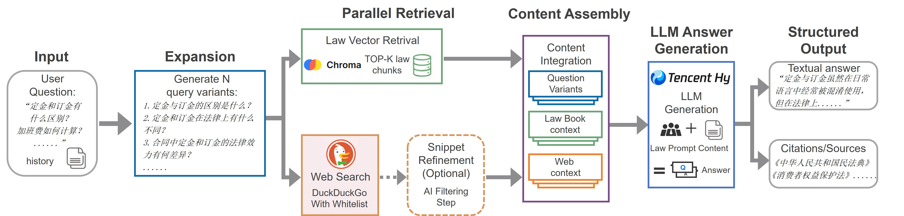
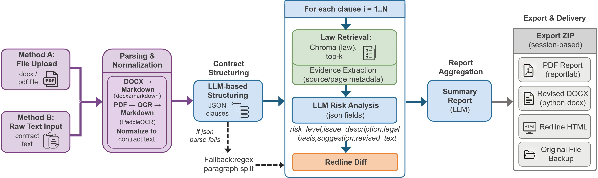
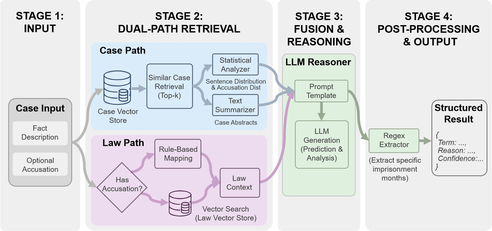
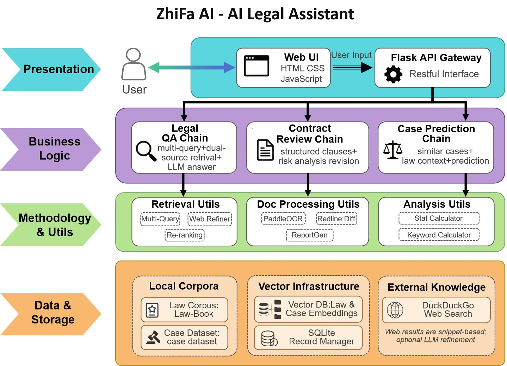
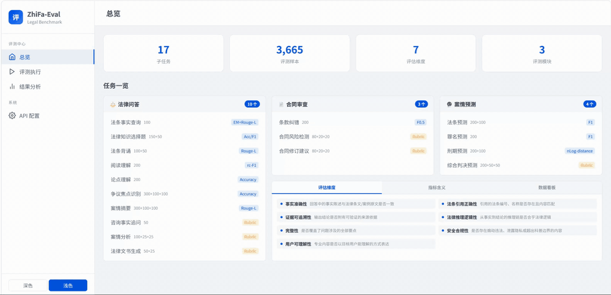

# 智法AI (ZhiFa AI) — 基于 Hy3 的专业法律智能助手


**智法AI** 是一款面向法律场景的 AI 助手，以腾讯混元 Hy3 为核心推理引擎，结合 RAG 检索增强生成与实时互联网搜索，为用户提供法律问答、合同审查、案情预测、法条检索四大能力。系统全程通过 API 调用 Hy3，配备 Web 可视化前端，开箱即用。


## 📑 目录

- [🎯 Hy3 在系统中承担的角色](#-hy3-在系统中承担的角色)
- [🌟 核心功能](#-核心功能)
- [🛠️ 系统架构](#️-系统架构)
- [🚀 快速开始](#-快速开始)
- [📂 项目结构](#-项目结构)
- [🎬 Demo 演示](#-demo-演示)
- [💻 CodeBuddy 协作记录](#-codebuddy-协作记录)
<!-- - [📄 许可证](#-许可证) -->


## 🎯 Hy3 在系统中承担的角色

Hy3 作为系统的核心推理引擎，贯穿法律问答、合同审查、案情预测全链路，负责理解、分析与生成。

| 功能模块 | Hy3 介入环节 | 具体任务 |
| ---------- | ---------------------- | --------------------------------------------------------------------------- |
| **法律问答** | 网页提炼 + 答案生成 | 过滤并提炼搜索结果；结合法条与网页内容，推理生成带引用的专业回答 |
| **合同审查** | 拆解 + 逐条分析 + 汇总 | 结构化拆解合同条款；逐条判断风险等级并给出修改建议；汇总生成审查报告 |
| **案情预测** | 查询扩展 + 综合分析 | 生成多角度检索查询（MultiQuery）；综合相似案例与刑法条文，预测罪名和刑期 |
| **多轮对话** | 上下文理解 | 维护对话历史，理解追问与指代，实现连续法律咨询体验 | 

**调用方式**：通过 OpenAI 兼容接口 (`https://wcode.net/api/gpt/v1`) 调用 `tencent/hy3`，全程 API 调用，无本地推理 / 微调 / 部署。


## 🌟 核心功能

### 1. 🤖 法律智能问答 (Legal Q&A)

基于 RAG 检索增强生成的多源法律问答系统，支持多轮对话、来源溯源、可追溯输出。

- **多轮对话**：维护对话历史，支持追问与上下文指代
- **来源溯源**：回答中标注所引用的法律条款及网页 URL
- **可溯源输出**：结构化回答 + 证据列表，用户可直接追溯生成依据

**实现方式**：系统并行执行法律向量检索（Multi-Query 多角度扩展）与 DuckDuckGo 网页搜索，结果经白名单过滤和 Hy3 AI 提炼后，按"法条优先、来源可溯、控制冗余"的原则构建上下文，由 Hy3 生成带引用的专业回答。



### 2. 📝 智能合同审查 (Contract Review)

采用"分而治之"策略的自动化合同审查系统，将长文档审查任务分解为标准化的条款级处理流程。

- **多格式输入**：支持 Word (.docx)、PDF（通过 PaddleOCR 识别）、纯文本，统一归一化为 Markdown 格式
- **逐条风险分析**：Hy3 对每个条款进行风险等级判定（高/中/低），输出问题描述与修改建议
- **红线修订**：基于 difflib 算法生成字符级修订标记，直观展示红绿修订对比
- **一键导出**：PDF 审查报告 + 修订 Word 文档 + 交互式 Redline HTML + 原件备份，ZIP 打包交付

**实现方式**：合同文本经格式解析后，由 Hy3 进行结构化拆解，将连续文本切分为独立的 JSON 条款对象（解析失败时自动回退到正则分段）。随后系统并行处理各条款：检索 ChromaDB 中 Top-K 相关法条作为审查依据，再由 Hy3 结合条款内容与法条生成结构化风险分析。全部条款分析完成后，Hy3 汇总所有风险点生成总览报告。



### 3. ⚖️ 案情预测 (Case Prediction)

基于相似案例检索与刑法条文融合推理的案情分析系统，辅助用户进行罪名分类与刑期预测。

- **双路检索**：案例库余弦相似度召回 Top-K 历史案例 + 刑法条文向量检索，构建完整法律上下文
- **刑期预测**：Hy3 综合法定量刑幅度与相似案例判决结果，输出具体刑期预测范围及置信度
- **罪名识别**：自动识别案情涉及的罪名，标注对应法律依据
- **结构化输出**：通过正则提取器解析为 JSON 格式，包含罪名、刑期范围、相似案例引用

**实现方式**：系统接收用户案情描述后，由 Hy3 提取关键法律要素并通过 Embedding 模型转化为高维向量。随后发起双路并行检索：案例路径从 ChromaDB 案例库召回相似历史案例并自动聚合生成判决分布统计；法条路径定位相关刑法条文。Hy3 接收相似案例摘要与法条上下文，模拟"依法量刑、参考判例"的推理模式，生成兼具法律依据与司法实践参考的预测结论。



### 4. 📚 法律知识库检索 (Legal Knowledge Retrieval)

内置法律法规库与刑事案例库，支持语义检索和分类浏览。

- **法律法规库**：涵盖宪法、民法典、刑法等核心法律，按条款结构化索引，支持自然语言语义搜索
- **案例数据库**：收录刑事案例数据集，按罪名、刑期等维度结构化存储，支持相似案情检索
- **分类导航**：按法律部门（民商法、刑法、行政法等）分类展示，方便浏览查阅


## 🛠️ 系统架构



系统采用 Flask 作为 Web 服务层，下接三大核心子系统，统一通过 API 调用腾讯混元 Hy3：

- **法律问答子系统**：并行检索框架兼顾权威性与时效性——一路通过 DuckDuckGo 实时搜索并提炼要点，另一路基于 LLM 生成多查询变体在 ChromaDB 法律知识库中语义检索，多源证据在上下文融合模块中整合，保留来源信息供溯源。

- **合同审查子系统**：混合预处理管线处理异构文档（电子文档直接解析，扫描件调用 PaddleOCR 识别），统一归一化后进入条款级迭代机制——LLM 将合同结构化为条款单元，逐条触发法条检索并生成风险分析与修订建议，避免长文档场景下的上下文稀释问题。

- **案情预测子系统**：从案情描述中提取关键事实线索，并行检索相似案例库与刑法条文库构建参考证据，同时聚合相似案例元数据（罪名分布、量刑区间）进行统计分析，为罪名与刑期预测提供可审查的推理路径。


## 🚀 快速开始
### 1. 环境准备

```bash
cd ZhiFa

# 创建 conda 环境
conda create -n zhifa python=3.10 -y
conda activate zhifa

# 安装依赖
pip install -r requirements.txt
```

### 2. 配置 API Key

在项目根目录创建 `.env` 文件：

```env
# 腾讯混元 API 配置（万码云 OpenAI 兼容端点）
HUNYUAN_API_KEY=your_api_key_here

# 百度飞桨 PaddleOCR API 配置（合同审查图片/扫描件识别）
PADDLE_OCR_API_TOKEN=your_paddle_ocr_token_here
PADDLE_OCR_MODEL=PaddleOCR-VL-1.6
```

### 3. 初始化向量数据库（仅首次运行）

首次启动前需初始化 ChromaDB 向量库，后续运行无需重复执行。

```bash
# 初始化法律法规库（读取 data/Law-Book 下的法律文档）
python scripts/init_law_vectorstore.py

# 初始化案例库（读取 data/case_dataset 下的案例数据）
python scripts/init_case_vectorstore.py
```

### 4. 启动

```bash
python run.py
```

访问 `http://localhost:5000` 即可使用。


## 📂 项目结构

```
ZhiFa/
├── data/
│   ├── Law-Book/           # 法律法规 Markdown（宪法、民法典、刑法等 8 大部门）
│   └── case_dataset/       # 刑事案例 JSON 数据集
├── scripts/                # 向量数据库初始化脚本
├── src/
│   ├── api/                # Flask 路由（qa、contract、case、law、settings）
│   ├── chain/              # LangChain 业务逻辑链 + Prompt 模板（核心）
│   ├── config/             # 系统配置（模型、向量库、搜索参数）
│   ├── core/               # 模型工厂、缓存管理、预加载
│   ├── utils/              # 工具库（docx2markdown、OCR、红线对比、导出）
│   ├── vectorstore/        # ChromaDB 封装（加载器、分块器、检索）
│   └── app.py              # Flask 应用入口
├── static/                 # 前端资源（CSS、JS、多语言 i18n）
├── storage/                # 运行时存储（ChromaDB 数据、临时上传）
├── templates/              # Web 前端单页应用
├── tests/                  # 单元测试（问答、合同、案情、向量库）
├── .env                    # 环境变量（API Key，不入库）
├── requirements.txt        # Python 依赖
├── settings.json           # 运行时模型设置（前端可配置）
├── usage_stats.json        # 功能调用次数统计
└── run.py                  # 启动脚本
```


## 🎬 Demo 演示

### Demo 1：系统全览

演示系统的完整交互界面，包括法律问答、合同审查、案情预测、法条检索、系统设置等各功能页面的展示与基本操作流程。



> 完整视频：[点击查看 MP4](assets/demo1.mp4)

### Demo 2：法律智能问答（多轮对话）

演示法律问答的多轮对话能力：先提出一个法律问题获取回答，再追问第二个问题，系统自动保留上一轮对话历史，结合上下文生成连贯的专业回答。回答下方附有引用来源链接，点击即可跳转网页。


> 完整视频：[点击查看 MP4](assets/demo2.mp4)

### Demo 3：智能合同审查（纯文本 + PDF + 停止审查）

演示合同审查功能的完整流程：首先输入纯文本合同进行审查，查看逐条风险分析与修改建议；接着上传 PDF 格式合同文件，系统通过 OCR 识别后同样完成审查；最后演示审查过程中点击"停止审查"按钮，验证任务可随时中断。


> 完整视频：[点击查看 MP4](assets/demo3.mp4)

### Demo 4：案情预测（相似案例 + 法条检索）

演示案情预测功能的完整流程：输入一段案情描述，系统自动检索相似历史案例与相关刑法条文，综合分析后给出罪名预测、量刑范围，并展示匹配的相似案例和对应法律条文供参考。


> 完整视频：[点击查看 MP4](assets/demo4.mp4)

### Demo 5：法律知识库检索（分类筛选 + 语义搜索）

演示法律知识库的检索功能：通过分类筛选（宪法、民法典、刑法等）快速定位法律部门，通过搜索栏输入关键词缩小范围，支持在法律法规库与刑事案例库之间切换浏览。


> 完整视频：[点击查看 MP4](assets/demo5.mp4)


## 💻 CodeBuddy 协作记录

本项目在开发过程中全程使用 **CodeBuddy** 进行 AI 辅助编程，覆盖架构设计、核心逻辑、前端交互、测试等环节。

**核心业务逻辑（src/chain/）**
- `legal_question_answering.py` — RAG 问答链完整实现：Multi-Query 检索、网页 AI 提炼、流式生成、对话历史管理
- `contract_review.py` — 合同审查链：结构化拆解、并行条款分析、风险汇总报告生成
- `case_prediction.py` — 案情预测链：双路检索、融合推理、结构化输出解析
- `law_web_retriver.py` — 自定义网页检索器：白名单过滤、可信度排序、优先级策略
- `*_prompt.py` — 各模块 Prompt 模板设计与调优

**工具库（src/utils/）**
- `redline_diff.py` — 合同红线修订对比算法（字符级 diff）
- `export_utils.py` — 多格式导出（PDF via reportlab、Word via python-docx、HTML、ZIP 打包）
- `file_converter.py` — 异构文档转换（PDF/图片 → 文本，集成 PaddleOCR）
- `docx2markdown/` — Word 文档解析转 Markdown（保留段落层级）

**向量数据库（src/vectorstore/）**
- `loader.py` / `case_loader.py` — 法律文档与案例数据加载器
- `splitter.py` — 文本智能分块（按条款/段落切分）
- `utils.py` — ChromaDB 操作封装与检索接口

**系统架构与配置**
- `src/core/model_factory.py` — Hy3 模型统一创建工厂（支持流式/非流式/热更新）
- `src/core/cache_manager.py` — 缓存管理与预加载机制
- `src/config/config.py` — 全局配置体系设计（动态加载 settings.json）
- `src/api/` — Flask RESTful API 路由设计与实现

**前端与测试**
- `templates/index.html` — Web 单页应用（多 Tab 布局、流式响应渲染、i18n 多语言）
- `static/js/app.js` — 前端交互逻辑（Markdown 渲染、文件上传、流式输出）
- `static/css/style.css` — 响应式 UI 样式
- `tests/` — 各模块单元测试（问答链、合同审查、案情预测、向量库、OCR 识别）


## 📄 许可证

本项目代码采用 [MIT 许可证](LICENSE) 开源。

**数据来源声明**：`data/Law-Book/` 中的法律法规数据来源于 [LawRefBook/Laws](https://github.com/LawRefBook/Laws)，该数据集遵循其原始仓库的开源协议，在此对原作者表示感谢。

